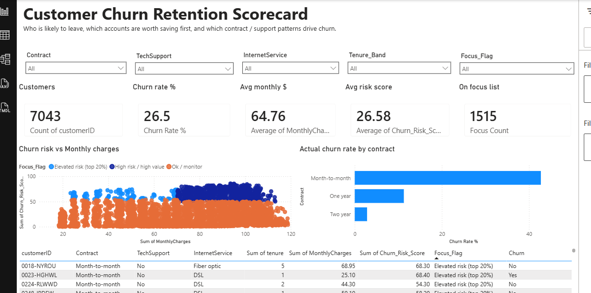

# Customer Churn Retention Scorecard

Customer-level look at who is likely to leave, which of those accounts are worth saving first, and which product / contract patterns drive churn. Built to answer a simple question: where should a retention team dig in first?

Data comes from the public IBM Telco Customer Churn sample.

## Dashboard



**Live Power BI report:** [Open in Power BI Service](https://app.powerbi.com/groups/me/reports/f4255352-c347-4ab9-a4fe-4acee8713ace/6be96214268e9bb28511?experience=power-bi)

Backup browser view (no Power BI login): [GitHub Pages dashboard](https://srimannarayana-ai.github.io/customer-churn-retention-scorecard/live-dashboard/)

Desktop file:

`03_outputs/Customer_Churn_Retention_Scorecard.pbix`

Data for refresh:

`03_outputs/PowerBI/Churn_Scorecard_Data.xlsx`

Pages:
- **Scorecard** – slicers (contract, tech support, internet, tenure band, focus flag), KPI cards, risk vs spend scatter, churn-by-contract bars, customer table
- **Focus list** – 1,515 customers to review first (high risk / high value + elevated risk)

Quick totals on Scorecard (unfiltered): 7,043 customers, ~26.5% churn, avg monthly charges ~$64.76, avg risk score ~26.6, 1,515 on the focus list.

Focus list breaks down as:
- 1,267 high risk / high value (Churn_Prob ≥ 0.50 and MonthlyCharges ≥ median)
- 248 elevated risk (top 20% of Churn_Prob)

## Folder layout

```
customer-churn-retention-scorecard/
├── 01_raw/                 Telco CSV + download notes
├── 02_clean/               cleaned / scored customer table
├── 03_outputs/
│   ├── Customer_Churn_Retention_Scorecard.pbix
│   ├── PowerBI/Churn_Scorecard_Data.xlsx
│   └── model_metrics.json
├── docs/
│   ├── images/             dashboard screenshots
│   ├── live-dashboard/     GitHub Pages interactive view
│   ├── powerbi_setup.txt
│   ├── scope.txt
│   ├── data_dictionary.txt
│   ├── churn_model.txt
│   ├── focus_list.txt
│   └── retention_action_brief.txt
├── sql/                    SQL analysis + how to run it
├── scripts/
│   ├── build_churn_scorecard.py
│   ├── build_live_dashboard.py
│   └── run_sql_demo.py
├── requirements.txt
└── README.md
```

## How the risk score works

Short version: clean the customer table, encode categoricals, train logistic regression on an 80/20 stratified split, then score every customer with a churn probability. Focus list = high probability + high monthly value, plus the top risk quintile.

Full write-up: `docs/churn_model.txt`

Test-set metrics: Accuracy ~80.7% | Precision ~65.8% | Recall ~56.7% | F1 ~60.9% | ROC-AUC ~0.842

## Methodology & Design Decisions

**The question:**  
I wanted a single customer-level view a retention / CRM team could use to spot accounts that look likely to leave *and* are expensive enough to be worth a save offer. The core idea is risk × value, not risk alone.

**Why logistic regression:**  
Coefficients are easy to defend in an interview (raises vs lowers churn risk). I care more about a transparent screening model than squeezing the last point of accuracy from a black-box model.

**Why precision / recall / AUC, not accuracy alone:**  
Overall churn is ~26.5%. Accuracy can look fine while missing many leavers. Precision, recall, F1, and ROC-AUC show the real tradeoff between wasted outreach and missed churners.

**Why equal 0.50 threshold for Predicted_Churn:**  
It is the default, easy-to-explain cutoff. In a live program I would tune the threshold to call-center capacity and the cost of a false positive vs false negative.

**Focus list thresholds:**  
Two review buckets:
- High risk / high value: Churn_Prob ≥ 0.50 and MonthlyCharges ≥ median (~$70.35)
- Elevated risk: top 20% of Churn_Prob among all customers

Median spend separates “save first” revenue from lower-ARPU noise. Top 20% keeps a manageable second queue for cheaper digital nudges.

**What this is not:**  
This is a screening score for portfolio / analysis work, not a production scoring API and not proof that changing a product feature *causes* retention. Use it to decide where to look first and what to A/B test.

**Data vintage:**  
IBM Telco Customer Churn public sample (7,043 customers). Rebuild numbers can shift slightly if the source file is updated. Download steps live in `01_raw/README.md`.

## SQL analysis + retention brief

SQL follow-up on the cleaned customer table (contract / tech-support rollups, focus-list mix, windowed call list, tenure bands), plus a short note on how a retention team could use the focus list.

- `sql/churn_analysis.sql`
- `scripts/run_sql_demo.py` — load CSV → SQLite → print query results
- `docs/retention_action_brief.txt`

```bash
python scripts/run_sql_demo.py
```

## Rebuild the data (optional)

```bash
pip install -r requirements.txt
python scripts/build_churn_scorecard.py
python scripts/build_live_dashboard.py
```

Then open the `.pbix` in Power BI Desktop and hit **Home → Refresh**.

Keep `03_outputs/PowerBI/Churn_Scorecard_Data.xlsx` where it is — that path is what the Power BI file uses.

## Sharing

- Live Power BI: [Power BI Service report](https://app.powerbi.com/groups/me/reports/f4255352-c347-4ab9-a4fe-4acee8713ace/6be96214268e9bb28511?experience=power-bi)
- No-login browser view: [GitHub Pages dashboard](https://srimannarayana-ai.github.io/customer-churn-retention-scorecard/live-dashboard/)
- Or send both desktop files:
  1. `03_outputs/Customer_Churn_Retention_Scorecard.pbix`
  2. `03_outputs/PowerBI/Churn_Scorecard_Data.xlsx`

## Notes worth knowing

- Month-to-month contracts churn at ~42.7%; two-year contracts at ~2.8%.
- No Tech Support churns at ~41.6% vs ~15.2% with support.
- Early tenure (0–12 months) is the riskiest band (~47% churn).
- `Estimated_Annual_Revenue` is for dashboards only — it is not a model feature (it is MonthlyCharges × 12).
- This is a project score for analysis / portfolio use, not a live telecom production model.

## Docs

| File | What it covers |
|------|----------------|
| `docs/scope.txt` | KPIs, grain, filters |
| `docs/data_dictionary.txt` | Field definitions |
| `docs/churn_model.txt` | Model math and metrics |
| `docs/focus_list.txt` | Focus-list rules and counts |
| `docs/retention_action_brief.txt` | Prioritization notes for the focus list |
| `docs/powerbi_setup.txt` | Power BI report + refresh notes |
| `sql/` | SQL analysis + how to run it |
| `docs/images/` | Dashboard screenshots |
| `docs/live-dashboard/` | Browser dashboard (GitHub Pages) |
