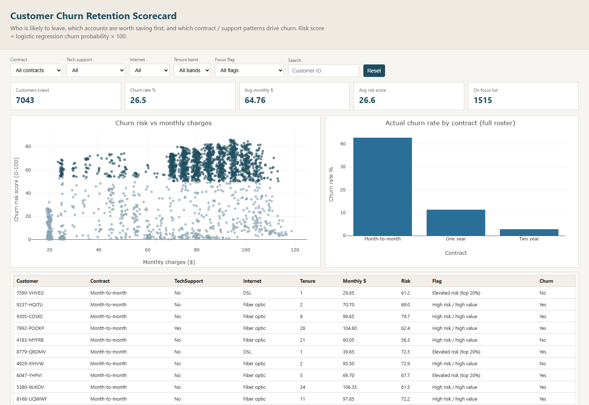

# Customer Churn Retention Scorecard

Customer-level look at who is likely to leave, which accounts are worth saving first, and which contract / support patterns drive churn.

Built on the public IBM Telco Customer Churn sample (7,043 customers).

## Power BI report

**File:** [`03_outputs/Customer_Churn_Retention_Scorecard.pbix`](03_outputs/Customer_Churn_Retention_Scorecard.pbix)

**Data source:** [`03_outputs/PowerBI/Churn_Scorecard_Data.xlsx`](03_outputs/PowerBI/Churn_Scorecard_Data.xlsx)


Pages:
- **Scorecard** — slicers (contract, tech support, internet, tenure band, focus flag), KPI cards, risk vs spend scatter, churn-by-contract bars, customer table
- **Focus list** — 1,515 customers to review first (high risk / high value + elevated risk)

Unfiltered totals: **7,043** customers · **26.5%** churn · avg monthly **$64.76** · avg risk **~26.6** · **1,515** on focus list

## Live browser dashboard

No Power BI install needed. Open [`docs/live-dashboard/index.html`](docs/live-dashboard/index.html) locally, or use GitHub Pages after enabling it on this repo.



Rebuild: `python scripts/build_live_dashboard.py`

## What this project does

1. Clean the Telco customer table  
2. Train a transparent logistic regression churn model (precision / recall / F1 / ROC-AUC — not accuracy alone)  
3. Score every customer and build a **risk × value** focus list  
4. Deliver a Power BI scorecard + browser dashboard for retention review  

Focus list:
- **1,267** high risk / high value — Churn_Prob ≥ 0.50 and MonthlyCharges ≥ median  
- **248** elevated risk — top 20% of Churn_Prob  

Test-set metrics: Accuracy ~80.7% · Precision ~65.8% · Recall ~56.7% · F1 ~60.9% · ROC-AUC ~0.842

## Folder layout

```
customer-churn-prediction/
├── 01_raw/                 Telco CSV + download notes
├── 02_clean/               cleaned / scored customer table
├── 03_outputs/
│   ├── Customer_Churn_Retention_Scorecard.pbix
│   ├── PowerBI/Churn_Scorecard_Data.xlsx
│   └── model_metrics.json
├── docs/
│   ├── images/             screenshots (Power BI + live dashboard)
│   ├── live-dashboard/     browser scorecard
│   ├── powerbi_setup.txt
│   ├── scope.txt
│   ├── data_dictionary.txt
│   ├── churn_model.txt
│   ├── focus_list.txt
│   └── retention_action_brief.txt
├── sql/                    SQL analysis
├── scripts/
│   ├── build_churn_scorecard.py
│   ├── build_live_dashboard.py
│   └── run_sql_demo.py
├── requirements.txt
└── README.md
```

## Rebuild

```bash
pip install -r requirements.txt
python scripts/build_churn_scorecard.py
python scripts/build_live_dashboard.py
```

Then open the `.pbix` and use **Home → Refresh**.

Excel sheets used by the report: `customers`, `focus_list`, `segment_rates`, `kpis`, `top_drivers`, `confusion_matrix`.

SQL demo:

```bash
python scripts/run_sql_demo.py
```

## Key findings

- Month-to-month contracts churn at ~42.7%; two-year contracts at ~2.8%
- No Tech Support churns at ~41.6% vs ~15.2% with support
- Early tenure (0–12 months) is the riskiest band (~47% churn)

## Docs

| File | What it covers |
|------|----------------|
| `docs/scope.txt` | KPIs, grain, filters |
| `docs/data_dictionary.txt` | Field definitions |
| `docs/churn_model.txt` | Model math and metrics |
| `docs/focus_list.txt` | Focus-list rules and counts |
| `docs/retention_action_brief.txt` | How a retention team can use the list |
| `docs/powerbi_setup.txt` | `.pbix` path + refresh notes |
| `sql/` | SQL analysis |

## Data source

https://raw.githubusercontent.com/IBM/telco-customer-churn-on-icp4d/master/data/Telco-Customer-Churn.csv

Saved locally as `01_raw/WA_Fn-UseC_-Telco-Customer-Churn.csv`.
